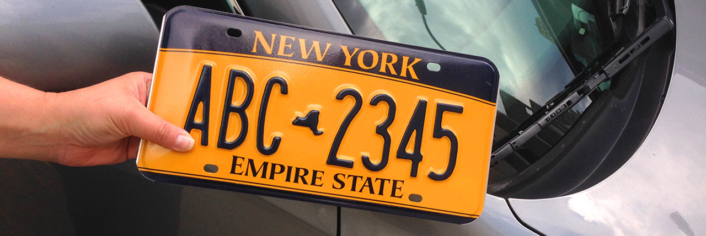

# Se7en

## Table of content
* [General info](#general-info)
* [Data Sources](#data_sources)
* [Setup](#setup)
* [Features](#features)
* [Status](#status)
* [Inspiration](#inspiration)
* [Contact](#contact)

## General info
Project Proposal: How is the car you drive affecting the air quality in your neighborhood?

### Data Sources
* Vehicle distribution in New York State (https://data.ny.gov/Transportation/Vehicle-Snowmobile-and-Boat-Registrations/w4pv-hbkt)  
* Air Quality data  (https://docs.airnowapi.org/HistoricalObservationsByZip/docs)  
Notes: Limiting our sample to New York State

### Preview of the vehicle data set

### Questions
1. Does the density of cars in a particular area affect air quality?
2. Does the age of cars affect air quality?
3. Does the type of car affect air quality?
4. Is a hybrid/electric car more beneficial to our health?

### APIs:
* https://dev.socrata.com/foundry/data.ny.gov/w4pv-hbkt : used to retrieve the vehicle data
* Air Quality API from AirNow
* Google Maps API

## Reports

## Setup
Required dependencies:

pip install pandas  
pip install sodapy

## Contact
Created by 
[@celeste1030](https://github.com/) 
[@deepavadakan](https://github.com/) 
[@paloni-dotcom](https://github.com/) 
[@timsamson](https://github.com/) 
[@williamrosen](https://github.com/) 