# Air Quality vs Vehicles

## Table of content
* [General info](#general-info)
* [Questions](#questions)
* [Data Sources](#data_sources)
    * [Preview](#preview)
* [APIs](#APIs)
* [Data Cleaning](#Data_Cleaning)
* [Data Visualization](#Data_Visualization)
* [Reports](#reports)
* [Setup](#setup)
* [Team](#team)

## General info
Project Proposal: How is the car you drive affecting the air quality in your neighborhood?

## Questions
1. Does the density of cars in a particular area affect air quality?
2. Does the age of cars affect air quality?
3. Does the type of car affect air quality?
4. Is a hybrid/electric car more beneficial to our health?

## Data Sources
* Vehicle distribution in New York State (https://data.ny.gov/Transportation/Vehicle-Snowmobile-and-Boat-Registrations/w4pv-hbkt)  
* Air Quality data  (https://docs.airnowapi.org/HistoricalObservationsByZip/docs)  
Notes: Limiting our sample to New York State

### Preview of the vehicle data set

## APIs:
* https://dev.socrata.com/foundry/data.ny.gov/w4pv-hbkt : used to retrieve the vehicle data
* Air Quality API from AirNow
* Google Maps API

## Data Cleaning
* **data_cleaning_1 notebook**: Gathered the Air Quality Index data from AirNow for zipcodes in New York that had EPA reporting agencies. Since there was a limit to the number of requests per hour to AirNow, we had to retrive this data over a period of time. (Please do not run this notebook or it will over write the csv files.)
* **data_cleaning_2 notebook**: Gathered the vehicle data from data.ny.gov and cleaned the data to retrieve passenger and commercial vehicles and the columns we needed.

## Data Visualization
* **density_of_vehicles notebook**: Compares the AQI with the density of vehicles by zipcode. Statistical Analysis and heat maps done on the resulting data.
* **age_of_vehicles notebook**: Compares the AQI with the age of vehicles by zipcode. Statistical Analysis and heat maps done on the resulting data.
* **fuel_type_of_vehicle notebook**: Compares the AQI with the percentage of green(hybrid/electric) vehicles by zipcode. Statistical Analysis and heat maps done on the resulting data.

## Reports

#### Comparing Air Quality Index for 2009, 2015 and 2020
<table>
  <tr>
    <td></td>
    <td>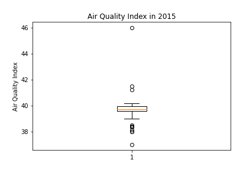</td>
    <td>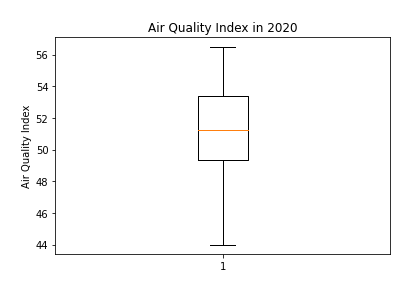</td>
  </tr>
</table>  

* The Air Quality Index in 2009 was an average of 68 with a few outliers.  
* 2015 had an average Air Quality Index of 39 which is a significant drop. However, this year had many outliers.  
* In 2020, the average Air Quality Index was around 50 which is an increase from 2015 and decrease from 2019.   
* Overall, the Air Quality has improved from 2009 to 2020.  

#### New York Car Density vs. Median AQI  
<table>
  <tr>
    <td></td>
  </tr>
</table>  

* Here we are comparing the Median Air Quality Index for 2009, 2015 and 2020 to car density.
* The colors of each bar correspond to Air Quality Index color gradient. Yellow = Moderate, Green = Good.
* Once again, we see that increased car density over the last decade has no affect on AQI.  

<table>
  <tr>
    <td></td>
    <td>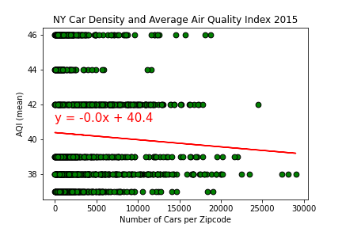</td>
    <td></td>
  </tr>
</table>  

* Here we are comparing the Air Quality Index based on density of cars by zipcode.
* The following scatter plots for years 2009, 2015 and 2020 show that density of cars in a given area does not have a correlation to the average Air Quality Index.

<table>
    <tr>
        <td></td>
        <td></td>
    <tr>
<table>
 
* Based on Heat map we can see some correlation. Areas with high AQI shows high density of cars.

<table>
    <tr>     
        <td></td>
        <td></td>
    <tr>
<table>
        
* 2015 was a strange year. Although number of cars increased, AQI is much lower compare to 2009. This shows that there is no correlation between high AQI vs car density if we compare 2009 vs. 2015. 

<table>
    <tr>        
        <td></td>
        <td></td>
    <tr>
<table>

* In 2020 even thouhg numbers of cars increased between 2015-2020, AQI does not shows very minimal to no increase. 

#### AQI vs. Median Age of Vehicles
<table>
  <tr>
    <td>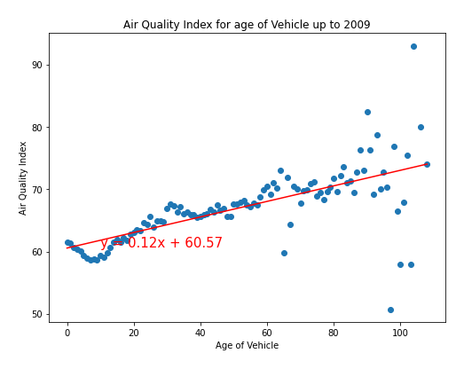</td>
    <td>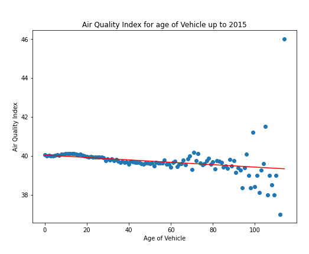</td>
    <td></td>
  </tr>
</table>  

* Here we are comparing the Air Quality Index based on the age of the cars by zipcode.  
* In 2009, the scatter plot shows that the Air Quality was better in areas with newer cars than with older cars.  
* In 2015, the scatter plot does not show much difference in the air quality index. Though, there was a wide range of Air Quality Index values for older cars.  
* In 2020, the Air Quality Index dropped for areas that have older cars. This may be because they are not in use as much or these cars are slowly being phased out.  
* r- squared values:
    * 2009 -  0.44811961222406105
    * 2015 -  0.06117003935198434
    * 2020 -  0.7560052918089275

<table>
    <tr>
        <td></td>
        <td></td>

* In above 2009 heat map comparison we see age of cars mean by zip code. It shows some correlation between the maps. High AQI areas have higher mean of car age. 
        
<table>
    <tr>
        <td></td>
        <td></td>

* Again, in 2015 we see significant AQI improvement across NY state; however, mean of car age has only increases in those areas.
        
<table>
    <tr>
        <td></td>
        <td></td>

* In 2020 we see AQI does not change a lot but mean of car age again only increases in this areas.        
        
        
#### AQI vs. Body Type of Vehicles
<table>
  <tr>
    <td></td>
    <td>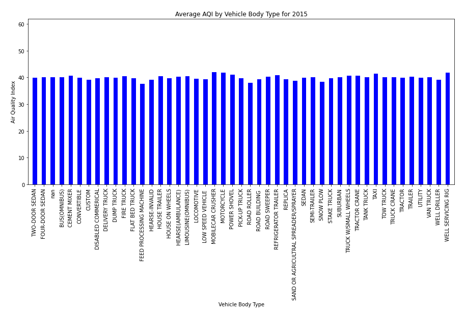</td>
    <td></td>
  </tr>
</table>  

* There does not seem to be any difference in the type of car and the Air Quality.

#### AQI for Private vs Commercial vehicles
<table>
  <tr>
    <td>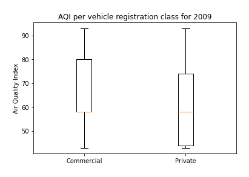</td>
    <td>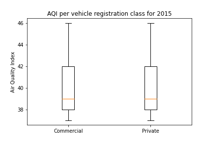</td>
    <td>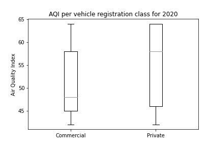</td>
  </tr>
</table>  

* In 2009, areas with more commercial vehicles had a higher Air Quality Index which means poorer air quality.  
* In 2015, the air quality between commercial and private vehicles was almost the same.  
* In 2020, the air quality in areas with private vehicles was more than those with commercial vehicles.

#### AQI vs "Green" Electric/Hybrid vehicles
<table>
  <tr>
    <td>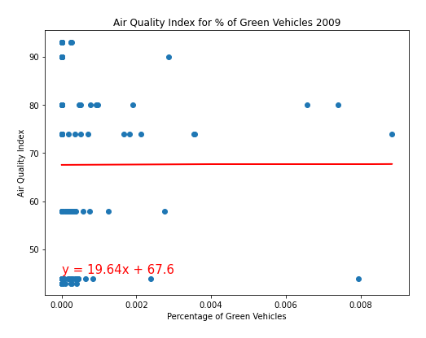</td>
    <td>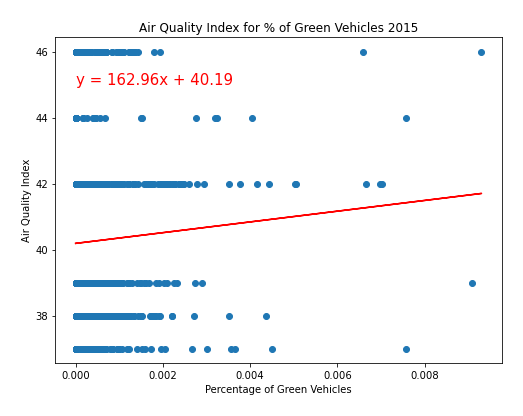</td>
    <td>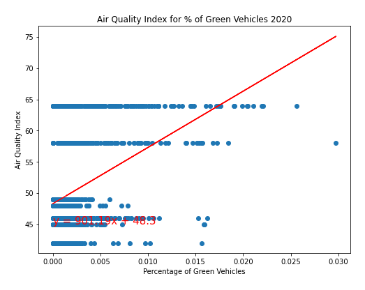</td>
  </tr>
</table>

* Given the low r- squared values:
    * 2009 -  2.2896326595606945e-07
    * 2015 -  0.0018160267526019039
    * 2020 -  0.16217576809651804
* There is no Correlation between AQI index and the number of “Green” vehicles in a zip code area. 

#### Comparison of ”Green” Vehicle Counts and NY Statewide Mean
<table>
  <tr>
    <td></td>
  </tr>
</table>

* Using our 3 datasets it is  evident that both the number of “Green” vehicles in the state and the mean (average numbers of green vehicles per zip code within the state) have increased dramatically.
* Green Vehicles ownership
    * From a low of 70 statewide in 2009 to 14,455 in 2020
    * Mean has increased from .04 to 12.51

#### Distribution of ”Green” vehicles in relation to AQI
<table>
  <tr>
    <td></td>
    <td></td>
    <td></td>
  </tr>
</table>

### Setup
Required dependencies:  
pip install pandas  
pip install sodapy

### Team
Created by 
[@celeste1030](https://github.com/) 
[@deepavadakan](https://github.com/) 
[@paloni-dotcom](https://github.com/) 
[@timsamson](https://github.com/) 
